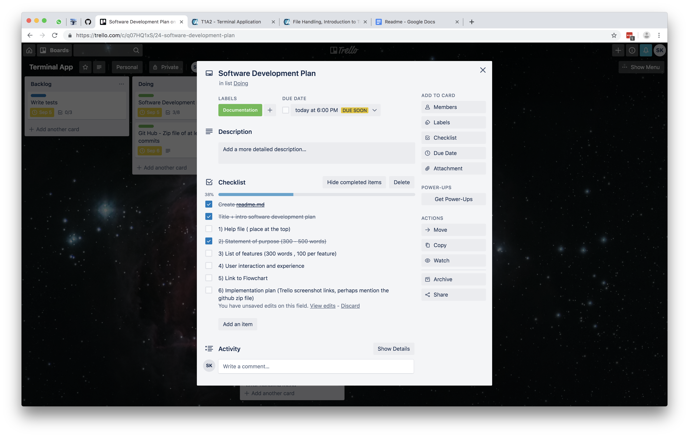
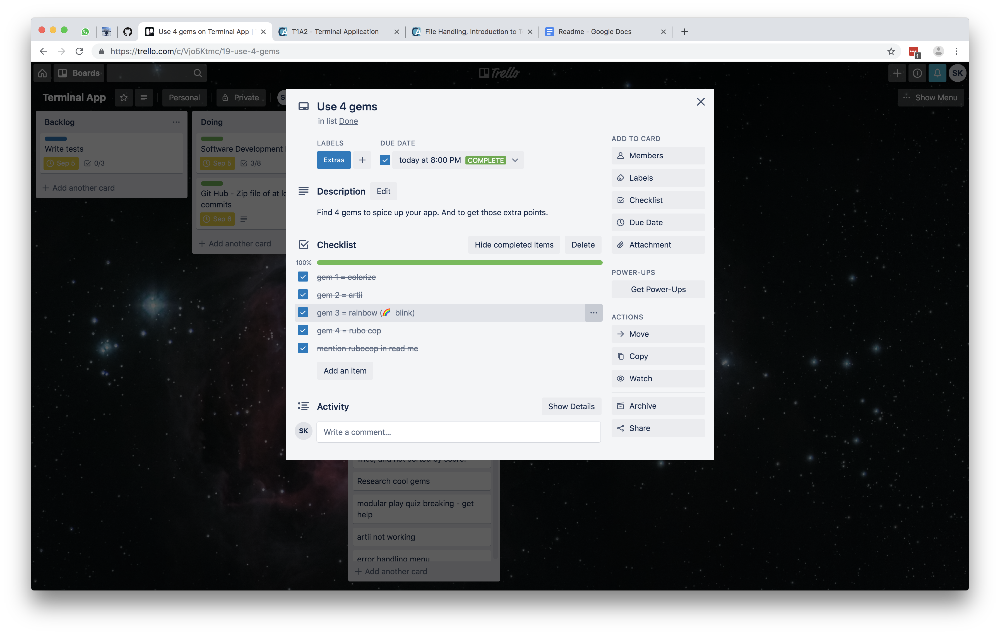

# Software Development Plan

This application was built by: Samaa Kanani<br>
GitHub: [Click here to view the repository](https://github.com/DevSamaa/capital_cities_app) 
<br>
<br>
<br>


This document contains the following information:
1. Help File
2. Statement of Purpose
3. List of Features
4. User Interaction and Experience
5. Control Flow Diagram	
6. Implementation Plan
<br>
<br>
<br>


## 1. Help File

### 1.1 Installation Process, System/Hardware requirements and Dependencies
These instructions are for Mac, and other unix based systems. If you are using a Windows computer, please consult your administrator.
* Homebrew has to be installed
* Ruby 2.5.1 
* Turn on your speakers
* Open your terminal


Type this command into your terminal in order to install all the gems that are necessary in order to run this app.
````ruby
bash build.sh
````
The necessary gems are:
* colorize 
* artii
* rainbow
* tty-font
* rubocop

### 1.2 Explanation of the different features of the application

There are many features in this application. The main ones are:

Play Quiz<br>
This lets the user actually play a round of the quiz. It’s split up over multiple methods that contain loops, if statements and take arguments.

Add to High Score<br>
When the user either wins or loses, the game is over and they get to add themselves to the high score list. In order to do that the user is asked to type in their name. That input is then combined with the argument of the counter and appended to the high_score CSV file. 

View High Score<br>
The user can also view the high score. If they select that menu option, the code loops through and puts every line from the high_score.csv file. 

Menu<br>
The menu lets the user select whether they want to view the high score, start the quiz or exit the game. The user is a method and made out of an if statement.
<br>
<br>
<br>

## 2. Statement of Purpose

What:<br>
The app is called “Quiz World” and currently lets players guess the capital city of a country. The player will get one point for every question that they answer correctly. Once they answer 10 questions correctly, the game is over and the player has won. Players can also add their score to a high score list and view that list.
The quiz is set up in such a way, that other questions can be added in the future. This means that it could be used for a wide range of educational purposes.

Problem:<br>
Many people have a hard time retaining new information. This is true for many fields of study, including geography. In order to make it easier and more fun to learn the capital cities of various countries around the world, I want to create a quiz.
Since the quiz will be set up in a way that will allow for new questions to be added to it, it can later be used for other purposes. It could be turned into a quiz on programming concepts or ruby specific terminology for instance. 

Target Audience:<br>
Anyone who is interested in learning something new in a gamified way is part of the target audience. I myself fall into this category, and I have specifically chosen capital cities because this is something that I actually want to learn. One day I’d like to know the capital city of every country on earth. Since more questions can be added, the app can be modified to suit different peoples educational needs.

How:<br>
The user will start the app and then have three options. They’ll either be able to start a quiz, view the high score or exit out of the app. Once they start the quiz, they’ll have to answer 10 consecutive answers correctly in order to win.  If they answer a question incorrectly, they’ll lose the game. The user can play the quiz as many times as they like. Every time a quiz is started the questions and answers will be shuffled, so the user is not going to see the same questions in the same order every time. Regardless of whether the user wins or loses, they’ll be able to enter their score into a high score sheet in the form of a CSV file. They will also be able to view that high score list.
<br>
<br>
<br>

## 3. List of Features
* **Play Quiz**<br>
This is the main part of the application. Once the user chooses ‘start quiz’ from the menu, they’ll get to this part of the application. The code is spread over several files. The questions.rb file contains an array of hashes with the questions, multiple choice answer options, and the correct answer. The quiz.rb file is where the three main methods of the quiz are located. The play_quiz method starts with a counter of 0 and loops through until the counter gets to 10. When the game starts the questions in the array of hashes are shuffled to ensure that the user doesn’t always get the same order of questions. The code then goes to the ask_question method and show_answer method to display the question and answer that corresponds to the index of the counter.
The play quiz part of the app also contains error handling. If the user chooses an option other than 1, 2, 3, or 4, it tells them that this is not a valid option and they’ll get to repeat the question.

* **Add to High Score**<br>
Once the user gets to 10 points, they win and the game ends. The enter_high_score_win_method which is stored in a different file is then called. It takes the argument of (counter) to add the points to the high score list.
It also gets input from the user, by asking them to type in their name. It then combines the name and the score and appends that to the CSV file.

* **View High Score**<br>
The menu contains an if statement which lets the user select the ‘view high score’ option. If the user selects that option, the code loops through and puts every line from the high_score.csv file. The user will then be able to view all of the high scores that were recorded.

* **Menu**<br>
There is a menu which lets the user pick 1, 2, or 3 based on what they want to do. If they chose anything else, the else part of the if loop tells them that this is not a valid option. The loop then continues and prints the menu again. After viewing the high score or playing a game, the menu is printed again so that the user can choose what they want to do next.
<br>
<br>
<br>


## 4. User Interaction and Experience

**Discoverability**<br>
The user will be able to discover all of the features of the game as soon as it begins. The menu that is presented to the user clearly states the three things that the user can do at that moment:
* Start Quiz
* View High Score
* Exit Quiz

The only feature which they cannot see at the start is the ‘add your name to the high score’ feature. This will only be visible once they are done playing a round.
<br>

**User Interaction**<br>
Once the app is started the user can select one of the three menu options by typing in a number on their keyboard. 
While playing the quiz the user can choose between 4 options by typing a number on their keyboard.
When the game is over they can type in their name and then hit enter in order to add their name to the high score list. 
All of the interactions with the app are done through the keyboard.
<br>

**Error Handling**<br>
There are two places where error handling is being utilized.
When the menu appears the user can type in 1, 2, or 3. If they type something other than those digits, the else part of the if statement will tell the user that their choice is invalid and it will loop through to print the menu again. The user then has the chance to select 1, 2, or 3 again. This loop will run an infinite amount of times until the user makes a valid selection. 
The other part that works with error handling is the actual quiz. When the question is printed to the screen the user can select answer 1, 2, 3, or 4. If they type in anything else, the begin rescue prompts the user that they need to type a valid response. 
<br>
<br>
<br>


## 5. Control Flow Diagram	

<br>
<br>
<br>

## 6. Implementation Plan

I have used trello in order to plan the features, set deadlines and requirements for them. I also used it to keep track of which features were already finished and which ones I was still working on.
<br>
[You can view my public Trello board here](https://trello.com/b/YhcXHDc4/terminal-app)



